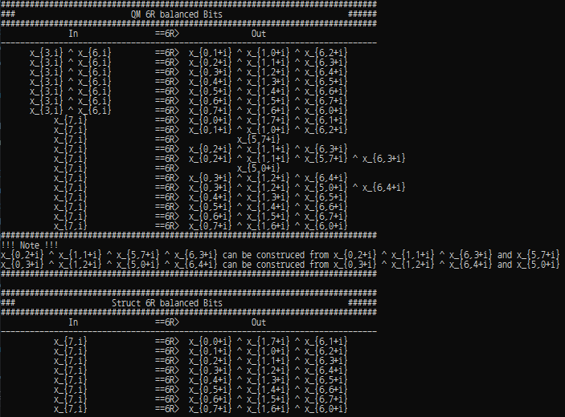

# Integral Cryptanalysis of Lightweight Block Cipher PIPO

This repository includes codes we used for integral cryptanalysis of lightweight block cipher PIPO.

### Ⅰ. There are two MILP models to obtain 6-round PIPO integral distinguishers based on Division Property.
1. launch_6R_pipo_qm.py
2. launch_6R_pipo_struct.py
- One can use one of the above scripts. 
- Therefore, enter "python3 launch_6R_pipo_qm.py" or "python3 launch_6R_pipo_struct.py" to obtain the distinguishers.

### Ⅱ. The following four folders assist the MILP models and print the integral distinguishers from the obtained results.
1. In the Folders "/prep_util" and "/front_gen", 
   - Utility functions are presented.
2. In the Folder "/ineq_gen",
   - Python scripts that we used to obtain MILP models (a set of inequalities) for PIPO S-box are presented.
   - One can obtain the models (sbox_ineq.py) by executing "python3 qm.py".
3. In the Folder "analysis_rsts",
   - One can print the obtained distinguishers from the above 6-round MILP models. 
   - Enter "python3 print_balanced_bits.py" with the obtained results [result_qm, result_struct].
   - The result should be as follows.

